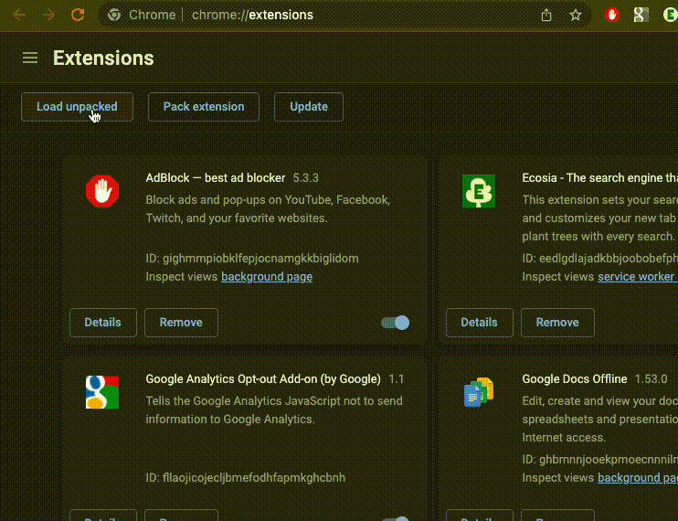

# Extension paywall news remover

A simple chrome extension to remove news that are behind a paywall

**Benefits**
- You don't have to read teasers for stories you will never buy

## Example

## Currently supported web pages
- heise.de
- zeit.de
- spiegel.de

If you want to contribute to support more web pages you are welcome to extend the block-paywall-news.js.

## Install chrome extension

In chrome-More tools-Extension view you can load the folder of this repository.

